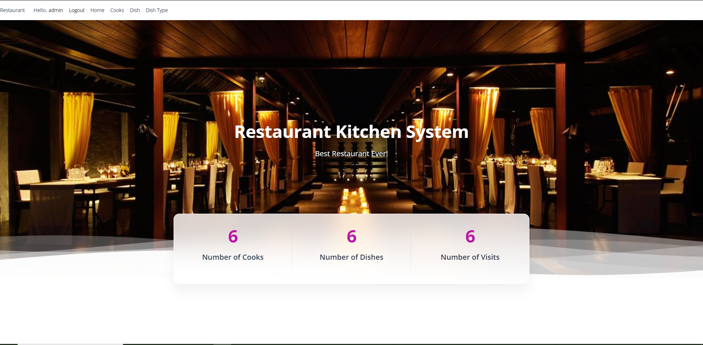

# Restaurant Kitchen Project

Django project for managing restaurant`s kitchen 

# Features

- Authentication functionality for cook
- Create, Update, Delete for dish, dish type and cooks
- Search bar for convenient managing

## Have a look!

[Restaurant Kitchen project deployed to Render](https://restaurant-kitchen-service-u948.onrender.com)

username:Guest
password:guest13579

## Installation 

Python3 must be already installed 
```shell
git clone https://github.com/DavidGlusch/restaurant-kitchen-service.git
cd restaurant-kitchen
venv\Scripts\activate (on Windows)
source venv/bin/activate (on macOS)
python3 -m venv venv
sourse venv/bin/activate
pip install -r requirements.txt
python manage.py runserver
```
## Demo

